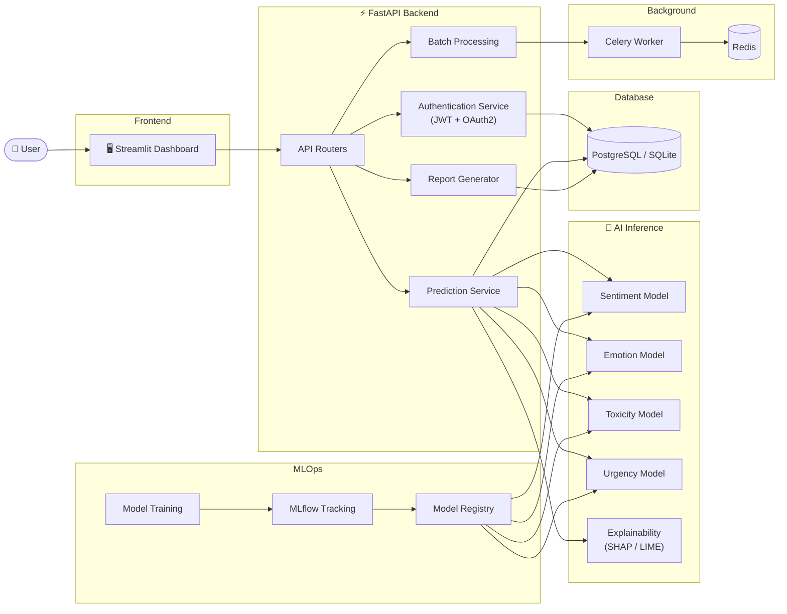

<div align="center">

# 🧠 Human Behavior Intelligence Platform

### AI-Powered Human Behavior Analysis Platform

Analyze human behavior from text using state-of-the-art Transformer models. Predict **Sentiment**, **Emotion**, **Toxicity**, and **Urgency** with Explainable AI.

<p>


</p>

**Production Ready • Explainable AI • FastAPI • Streamlit • Hugging Face**

⭐ If you find this project useful, please give it a Star!

</div>

---

# 📖 Overview

The **Human Behavior Intelligence Platform (HBI)** is a production-ready AI application that analyzes textual human behavior using advanced Natural Language Processing and Transformer models.

The platform combines a high-performance **FastAPI backend**, an interactive **Streamlit dashboard**, and powerful **Hugging Face Transformer models** to deliver accurate predictions with explainable insights.

Built using **Clean Architecture**, **SOLID Principles**, and the **Repository Pattern**, the project is designed for scalability, maintainability, and real-world deployment.

---

# ✨ Features

- 🔐 JWT Authentication & Role-Based Authorization
- 😊 Sentiment Analysis
- ❤️ Emotion Detection
- ☣️ Toxicity Detection
- 🚨 Urgency Prediction
- 💡 Explainable AI (Word-Level Highlighting)
- 📂 Batch CSV Processing
- 📊 Interactive Dashboard
- 📈 Confidence Visualization
- 📄 PDF & CSV Report Generation
- 📜 Prediction History
- 🤗 Hugging Face Transformers
- 🐳 Docker Support
- 📈 MLflow Integration
- ⚡ RESTful APIs
- ☁️ Cloud Deployment Ready

---

# 🏗️ Architecture


    

---

# 🚀 Tech Stack

| Category | Technology |
|-----------|------------|
| Backend | FastAPI |
| Frontend | Streamlit |
| Machine Learning | Hugging Face Transformers |
| Deep Learning | PyTorch |
| Database | PostgreSQL / SQLite |
| Authentication | JWT + OAuth2 |
| ORM | SQLAlchemy |
| Validation | Pydantic |
| Background Tasks | Celery + Redis |
| Explainability | SHAP, LIME |
| MLOps | MLflow, Optuna |
| Visualization | Plotly, Matplotlib |
| Deployment | Docker, Docker Compose |
| CI/CD | GitHub Actions |

---

# 📂 Project Structure

```text
human-behavior-intelligence-platform/
│
├── api/
├── configs/
├── core/
├── database/
├── inference/
├── repositories/
├── schemas/
├── services/
├── tasks/
├── training/
├── tests/
├── utils/
├── app.py
├── Dockerfile
├── docker-compose.yml
├── requirements.txt
└── README.md
```

---

# 🚀 Quick Start

### Clone Repository

```bash
git clone https://github.com/Bhavana998/human-behavior-intelligence-platform.git

cd human-behavior-intelligence-platform
```

### Create Virtual Environment

```bash
python -m venv venv

# Windows
venv\Scripts\activate

# Linux/macOS
source venv/bin/activate
```

### Install Dependencies

```bash
pip install -r requirements.txt
```

### Configure Environment

```bash
cp .env.example .env
```

Update the environment variables.

### Start Backend

```bash
uvicorn api.main:app --reload
```

### Start Frontend

```bash
streamlit run app.py
```

---

# 📡 REST API

### Register

```http
POST /api/v1/auth/register
```

### Login

```http
POST /api/v1/auth/login
```

### Prediction

```http
POST /api/v1/predict/single
```

Example Request

```json
{
  "text":"I love this product but I'm worried about the price.",
  "tasks":[
      "sentiment",
      "emotion",
      "toxicity",
      "urgency"
  ]
}
```

Example Response

```json
{
  "sentiment":"Positive",
  "emotion":"Joy",
  "toxicity":"Non-Toxic",
  "urgency":"Low"
}
```

---

# 📊 Dashboard Features

- Real-Time Predictions
- Confidence Charts
- Word-Level Explainability
- Batch CSV Upload
- Download Results
- Session History
- PDF Report Export

---

# 🐳 Docker Deployment

```bash
docker-compose up --build
```

Backend

```
http://localhost:8000
```

Frontend

```
http://localhost:8501
```

Swagger Docs

```
http://localhost:8000/docs
```

---

# ☁️ Deployment

Deploy on

- Render
- Railway
- Google Cloud Run
- Azure
- AWS
- Replit
- PythonAnywhere
- Streamlit Community Cloud

---

# 🧪 Testing

```bash
pytest tests/
```

---

# 🛣️ Roadmap

- 🌍 Multilingual Support
- 🎙️ Voice Emotion Analysis
- 📷 Image Behavior Analysis
- 🤖 LLM-Based Explainability
- 📱 Mobile Application
- ☸️ Kubernetes Deployment
- 📈 Real-Time Monitoring Dashboard
- 🔄 Continuous Model Retraining

---

# 🤝 Contributing

Contributions are welcome!

1. Fork the repository
2. Create a feature branch
3. Commit your changes
4. Push your branch
5. Open a Pull Request

---

# 📜 License

This project is licensed under the **MIT License**.

---

# 👩‍💻 Author

## **Bhavana Setty**

**AI Engineer | Machine Learning | NLP | MLOps**

GitHub: **https://github.com/Bhavana998**

---

<div align="center">

### Built with ❤️ using FastAPI, Streamlit, PyTorch and Hugging Face Transformers.

⭐ **If you found this project useful, please give it a Star!**

</div>
